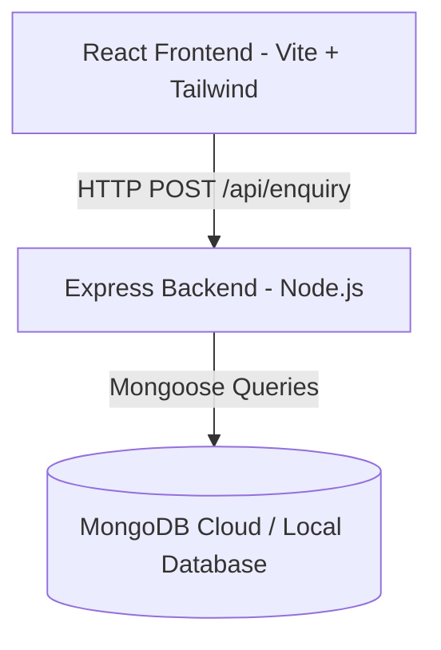

# Kidrove AI & Robotics Summer Workshop 🚀

A modern, responsive, and premium full-stack landing page and registration platform for children's educational bootcamps, inspired by the playful and polished visual style of Kidrove.

---

## 🎨 Visual Preview & Aesthetics

The platform features:
* **Playful EdTech Style**: Curved corners (`rounded-4xl`), soft gradient borders (`bg-linear-to-r`), vibrant background overlays, and modern Outfit/Inter typography.
* **Micro-Animations**: Hover-translate effect on feature cards and continuous floating vector icons (Rocket, Robot, Chip).
* **Interactive Elements**: Expandable FAQ accordion panel and validation-driven registrations with custom client feedback checkouts.

---

## 🏗 System Architecture

The project is structured as a decoupled full-stack application (client-server architecture):



* **Frontend**: React SPA powered by Vite, Tailwind CSS v4, and Axios.
* **Backend**: Node.js & Express API with CORS middleware and payload validation.
* **Database**: MongoDB instance modeled using Mongoose schemas.

---

## 📂 Project Directory Structure

```
workshop/
├── client/                     # Frontend Client (React + Vite)
│   ├── src/
│   │   ├── components/         # Modular React components
│   │   │   ├── icons.jsx       # Reusable SVG vector graphics
│   │   │   ├── Header.jsx      # Navigation header & mobile responsive drawer
│   │   │   ├── Hero.jsx        # Landing presentation, specs summary & graphics
│   │   │   ├── Details.jsx     # Course details specifications card
│   │   │   ├── Outcomes.jsx    # 6 curriculum outcome modules
│   │   │   ├── WhyJoin.jsx     # Parent trust benefit highlights
│   │   │   ├── FAQ.jsx         # Accordion panel toggling active questions
│   │   │   ├── Registration.jsx# Interactive registration input validation
│   │   │   └── Footer.jsx      # Bottom conversion banner & directory links
│   │   ├── data/
│   │   │   └── workshopData.jsx# Global program specs, FAQs, and outcome arrays
│   │   ├── App.jsx             # Main router composition
│   │   └── index.css           # Styling theme overrides & CSS animation keyframes
│   └── public/                 # Static visual resources (hero-robotics.png)
│
└── server/                     # Backend API Server (Node + Express)
    ├── models/
    │   └── enquiryFormSchema.js# Mongoose schema for customer inquiries
    ├── index.js                # Express startup, connection pools & route controller
    ├── .env                    # Environment key/value secrets (local only)
    └── .gitignore              # Dependency & secrets git tracking exclusions
```

---

## 🚀 Getting Started

### Prerequisites
Make sure you have [Node.js](https://nodejs.org/) (v18+) and [MongoDB](https://www.mongodb.com/) installed.

### 1. Server Setup
1. Navigate to the server directory:
   ```bash
   cd server
   ```
2. Install dependencies:
   ```bash
   npm install
   ```
3. Create a `.env` file in the `server` directory and add your keys:
   ```env
   PORT=3000
   MONGODB_URI=mongodb+srv://<username>:<password>@cluster.mongodb.net/workshop
   ```
4. Start the server in watch mode:
   ```bash
   node --watch index.js
   ```

### 2. Client Setup
1. Navigate to the client directory:
   ```bash
   cd ../client
   ```
2. Install dependencies:
   ```bash
   npm install
   ```
3. Launch the development server:
   ```bash
   npm run dev
   ```
4. Open [http://localhost:5173](http://localhost:5173) in your browser.

---

## 🔌 API Endpoints Reference

### Submit Enquiry Form
* **Endpoint**: `POST /api/enquiry`
* **Content-Type**: `application/json`
* **Request Body**:
  ```json
  {
    "name": "Jane Doe",
    "email": "jane@example.com",
    "phone": "9876543210"
  }
  ```
* **Success Response (200 OK)**:
  ```json
  {
    "message": "Enquiry received"
  }
  ```
* **Validation Failure (400 Bad Request)**:
  ```json
  {
    "message": "Phone number must be at least 10 digits long"
  }
  ```
